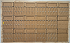

**First read the terms of service.**

By using the Booking system you confirm that you have read and understood the [Terms of service](/_pages/terms/). 

**Under no circumstances are students allowed to enter the booking room without a member of the booking staff present.**

-------------------------

## Borrowing Equipment
1. Browse this <a href="/_pages/equipmentListing.md/">catalog</a> to find the items that you want to borrow

2. Note any [category restrictions](/_pages/terms#restrictions) displayed for the items you are interested in borrowing *N.B SMILE or Lighting Design*

3. Locate the Equipment booking board in the CreaTech Lab, making sure that staff are present to complete your booking before removing any tags from the board

4. If there are no tags for your desired item on the board they are all currently lent out.

5. Tags hanging behind a reserved note have been prebooked for a particular future date. You may still borrow them, but it is imperative that they are returned BEFORE the prebooked date

6. Take the tags for the equipment that you want to borrow to a member of the booking staff

7. The staff member will ask you for the following information:
	- Whether you have obtained any necassary permissions for lending the equipment and meet any other requirements
	- How long you want each item - end of week, end of next week, end of month, end of next month, end of semester
	- Your borrower ID: The user name part of your student or staff email (This is the first part, preceding @student.aau.dk or @create.aau.dk)

-------------------------

## Returning equipment

1. If you become aware that you can not return equipment on time, contact the CreaTech Lab staff immediately
See the [terms of use](/_pages/terms) for more information

2. Always try to contact a member of the booking staff before returning equipment. Make sure that the equipment being returned is:
	- working
	- complete
	- packed in the same way that you borrowed it
	- where applicable, batteries have been removed

3. When returning equipment directly to booking staff, make sure that they know your borrower ID, that the ID number of the equipment is readable,
and that you report any issues with the equipment.

4. If no staff are present you may place your equipment on the returns counter next to the booking office. Make sure that you write the following information 
in the returns book otherwise we cannot register the return of your equipment:
	- Date
	- Your borrower ID
	- Equipent ID (typically starting AAU)
	- Any issues with the equipment

{{site.top}}

	